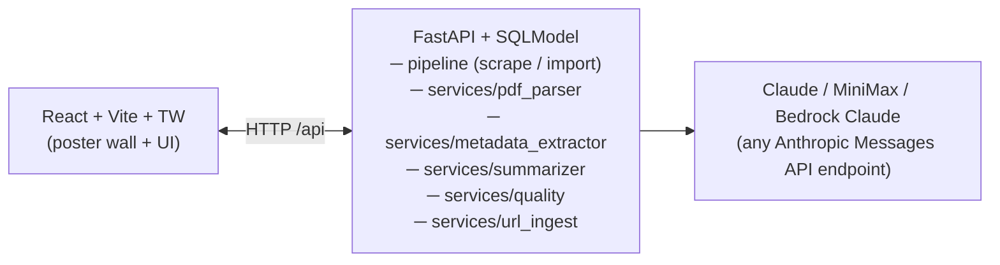

<div align="center">

# Paperfin

**A Jellyfin-style poster wall for your academic paper library.**

Import papers from arXiv or any PDF URL, watch your reading list grow as
a beautiful dark-themed gallery, and let an LLM write a structured summary
and a 0–100 quality score for each one.

[](./LICENSE)


</div>

---

## Features

- 📚 **Poster wall** — drop PDFs into a folder or paste an arXiv URL; each
  paper gets a first-page thumbnail and slots into a responsive grid.
- 🧠 **Structured LLM summaries** — separate `contribution / method / result`
  paragraphs plus topical tags, not a one-line abstract. Output language is
  configurable (English by default; Simplified Chinese ships in the box).
- ⭐ **Quality score** — 4-axis rubric (innovation, rigor, clarity,
  significance) weighted into a single 0–100 number, rendered as a radar chart.
- 🔗 **URL import** — paste any `arxiv.org/abs/...`, `arxiv.org/pdf/...`, or
  direct PDF link; the backend streams the download, dedups by arxiv id +
  content hash, and runs the full pipeline.
- 🔌 **Model-agnostic** — uses the Anthropic SDK, so you can point it at
  Claude, Amazon Bedrock Claude, or any gateway that speaks the Anthropic
  Messages API (MiniMax's `api.minimaxi.com/anthropic` is a drop-in example).
- 🎛 **Single-user, local-first** — no login, no cloud dependencies beyond the
  LLM API you configure. SQLite file lives next to the PDFs.
- 🚀 **Optional auto-start** — ships with macOS LaunchAgent templates for a
  background service that survives reboots.

## Screenshots

> _TODO: add screenshots of the poster wall and detail view._

## Architecture



- **Backend**: Python 3.11+, FastAPI, SQLModel, SQLite, PyMuPDF, pypdf,
  Anthropic SDK.
- **Frontend**: React 18 + Vite + TypeScript + TailwindCSS + React Query +
  Recharts.
- **Storage**: SQLite in `backend/data/paperfin.db`, PDFs in
  `backend/data/papers/`, thumbnails in `backend/data/thumbnails/`.

> **On "Anthropic-compatible":** the backend talks to the LLM through the
> [Anthropic Messages API](https://docs.anthropic.com/en/api/messages)
> (`/v1/messages`), *not* the OpenAI Chat Completions API
> (`/v1/chat/completions`). These are two different wire protocols with
> different request and response shapes — **the OpenAI SDK and
> OpenAI-shape endpoints (DeepSeek, Zhipu, Ollama's `/v1/chat/completions`,
> a vanilla vLLM server, etc.) are NOT drop-in replacements.** To use an
> OpenAI-family provider, either swap `backend/app/services/llm.py` to call
> the `openai` SDK instead, or put a translator like
> [LiteLLM](https://github.com/BerriAI/litellm) in front of it (LiteLLM
> exposes an Anthropic-shape endpoint that can forward to almost any
> backend).

---

## Quick start

### Prerequisites

| Tool | Version |
|---|---|
| Python | 3.11 or newer |
| Node | 18 or newer |
| An LLM API key | Any endpoint that speaks the Anthropic Messages API (Claude, MiniMax, Amazon Bedrock Claude, LiteLLM, …) |

### 1. Backend

```bash
cd backend
cp .env.example .env            # fill in ANTHROPIC_API_KEY / BASE_URL / MODEL
python3 -m venv .venv
.venv/bin/pip install -e .
.venv/bin/uvicorn app.main:app --reload --port 8000
```

Health check: `curl http://localhost:8000/health`

### 2. Frontend

```bash
cd frontend
npm install
npm run dev                     # http://localhost:5173
```

The Vite dev server proxies `/api/*` → `http://localhost:8000`, so the React
app can call relative URLs without CORS setup.

### 3. Import a paper

- **From URL**: click **Import URL** in the top right, paste an arXiv link
  (`https://arxiv.org/abs/2005.11401`) or any direct PDF URL.
- **From disk**: drop `*.pdf` files into `backend/data/papers/` and click
  **Scan library**.

Processing takes ~20–40 s per paper (two LLM calls: summary + quality score).

---

## Configuration

All config lives in `backend/.env` (see `.env.example`):

| Variable | Purpose | Default |
|---|---|---|
| `ANTHROPIC_API_KEY` | API key for the LLM endpoint | *(required)* |
| `ANTHROPIC_BASE_URL` | LLM endpoint URL | *(empty — official Anthropic)* |
| `ANTHROPIC_MODEL` | Model name to send | `claude-opus-4-7` |
| `SUMMARY_LANGUAGE` | Language for summaries + scoring rationales. `en` or `zh` | `en` |
| `SEMANTIC_SCHOLAR_API_KEY` | Optional, boosts rate limits *(M3)* | *(empty)* |
| `DATA_DIR` | Where PDFs, thumbnails, SQLite live | `./data` |
| `SCAN_INTERVAL_HOURS` | Default subscription interval *(M4)* | `6` |
| `LOG_LEVEL` | Python logging level | `INFO` |

**Using MiniMax as an Anthropic-shape gateway:**

```env
ANTHROPIC_API_KEY=sk-your-minimax-key
ANTHROPIC_BASE_URL=https://api.minimaxi.com/anthropic
ANTHROPIC_MODEL=MiniMax-M2.7
```

**Using a self-hosted model:**

Paperfin needs an endpoint that speaks the Anthropic Messages API
(`/v1/messages`). Most local inference servers — vLLM, Ollama,
text-generation-webui — default to the OpenAI Chat Completions shape
(`/v1/chat/completions`) and will **not** work if you just point
`ANTHROPIC_BASE_URL` at them.

Two workable paths:

1. **Front it with LiteLLM** (recommended). [LiteLLM](https://github.com/BerriAI/litellm)
   exposes an Anthropic-shape endpoint and can forward to whatever backend
   you configure (vLLM, Ollama, OpenAI, your own cloud, …). Run it in front
   of your local server and point `ANTHROPIC_BASE_URL` at the LiteLLM URL.
2. **Swap the SDK**. Edit `backend/app/services/llm.py` to call the `openai`
   SDK instead of `anthropic`, keeping the `chat_json(system, user, schema)`
   contract unchanged. All other code is model-agnostic.

**Changing summary language:**

Set `SUMMARY_LANGUAGE=zh` in `.env` and restart the backend to get
Simplified Chinese output from the summarizer and rubric reasoner. You can
also re-summarize an existing paper from the detail page to pick up the
new language without rescanning.

---

## Auto-start as a background service (macOS, optional)

Skip this if you only run Paperfin while developing.

```bash
# Render plist templates into ~/Library/LaunchAgents and load them.
./scripts/install-launchagents.sh

# Everyday control
cd backend
./agentctl.sh status     # are the agents alive?
./agentctl.sh logs backend
./agentctl.sh restart all
./agentctl.sh kick backend   # reload config after editing .env
./agentctl.sh stop all       # also disables auto-start at login
```

The LaunchAgents are configured with `KeepAlive`, so they're restarted if
they crash, and with `RunAtLoad` so they come up at login.

Uninstall:

```bash
cd backend && ./agentctl.sh stop all
rm ~/Library/LaunchAgents/ai.paperfin.*.plist
```

---

## API reference

| Method | Path | Purpose |
|---|---|---|
| GET | `/health` | Liveness probe |
| GET | `/api/papers` | List papers (filters: `min_score`, `source`, `status`, `sort`, `limit`) |
| GET | `/api/papers/{id}` | Full detail |
| GET | `/api/papers/{id}/pdf` | Stream the PDF (inline, for iframes) |
| GET | `/api/papers/{id}/thumbnail` | First-page JPEG |
| POST | `/api/papers/scan` | Queue a scan of `data/papers/` |
| POST | `/api/papers/import-url` | Import one paper by URL |
| POST | `/api/papers/{id}/resummarize` | Re-run summarizer + scorer on an existing paper |
| DELETE | `/api/papers/{id}` | Delete the record |

Interactive Swagger docs: `http://localhost:8000/docs`.

---

## Project layout

```
paperfin/
├── backend/
│   ├── app/
│   │   ├── main.py                   # FastAPI + CORS + lifespan
│   │   ├── config.py                 # Pydantic Settings
│   │   ├── db.py                     # SQLModel engine, init_db
│   │   ├── pipeline.py               # scan_local_directory / process_url
│   │   ├── api/papers.py             # REST endpoints
│   │   ├── models/                   # Paper / Subscription / Author / Institution
│   │   └── services/
│   │       ├── pdf_parser.py         # pypdf + PyMuPDF
│   │       ├── llm.py                # Anthropic-SDK wrapper, chat_json()
│   │       ├── metadata_extractor.py # title / authors / abstract
│   │       ├── summarizer.py         # structured summary (language from .env)
│   │       ├── quality.py            # 4-axis LLM rubric → 0-100
│   │       └── url_ingest.py         # arXiv URL parser + PDF download
│   ├── data/                         # user-generated, gitignored
│   ├── run.sh                        # dev launcher (sanitizes shell env)
│   ├── agentctl.sh                   # LaunchAgent controller
│   └── pyproject.toml
├── frontend/
│   ├── src/
│   │   ├── App.tsx                   # Router + header
│   │   ├── pages/
│   │   │   ├── Library.tsx           # Poster wall
│   │   │   └── PaperDetail.tsx       # Summary + radar + inline PDF
│   │   ├── components/
│   │   │   ├── PaperCard.tsx
│   │   │   └── ImportDialog.tsx
│   │   └── lib/api.ts                # Typed API client
│   └── package.json
├── launchd/                          # macOS LaunchAgent templates
│   ├── ai.paperfin.backend.plist.template
│   └── ai.paperfin.frontend.plist.template
├── scripts/
│   └── install-launchagents.sh       # renders templates + loads them
├── LICENSE
├── CONTRIBUTING.md
└── README.md
```

---

## Roadmap

- ✅ **M1** — local poster wall, URL import, LLM summary & quality score,
  configurable summary language, optional auto-start.
- 🚧 **M2** — arXiv subscriptions (`cat:cs.LG AND abs:"diffusion"` style
  queries, cron-driven fetch, per-subscription min-quality filter).
- 🚧 **M3** — Semantic Scholar enrichment (author h-index, venue, citation
  count) → fills the `author / institution / venue` axes of the quality radar.
- 🚧 **M4** — Settings UI for LLM config and scoring weights; tag / venue
  facets on the poster wall; subscription management UI.

## Design notes

- **Idempotent scans** — every PDF is hashed (SHA-256). Reprocessing the
  same file is free; thumbnails are named by hash.
- **Deterministic dedup** — URL imports check `arxiv_id` *before* download
  (saves bandwidth + LLM tokens) and `content_hash` *after* (catches the
  same paper via different URLs).
- **LLM safety** — every LLM call goes through
  `app/services/llm.chat_json`, which injects the target Pydantic schema
  into the system prompt, validates the JSON response, and retries
  transient parse/network errors with exponential backoff.
- **Failure isolation** — a paper that fails mid-pipeline gets
  `status=FAILED` with the error in the `error` column; the scan keeps
  going.

## Contributing

See [CONTRIBUTING.md](./CONTRIBUTING.md). Issues and PRs welcome —
particularly for the roadmap items above and for additional paper source
integrations.

## License

Licensed under the [MIT License](./LICENSE).

© Tencent. Paperfin is an open-source project maintained by Tencent.
